

<h1>

&nbsp;

</h1>

<strong>Data Science</strong> &nbsp;•&nbsp;
<strong>Machine Learning</strong> &nbsp;•&nbsp;
<strong>AI</strong> &nbsp;•&nbsp;
<strong>Computer Vision</strong> &nbsp;•&nbsp;
<strong>Explainable AI</strong>

&nbsp;&nbsp;&nbsp;

&nbsp;&nbsp;&nbsp;

&nbsp;&nbsp;&nbsp;

&nbsp;&nbsp;&nbsp;

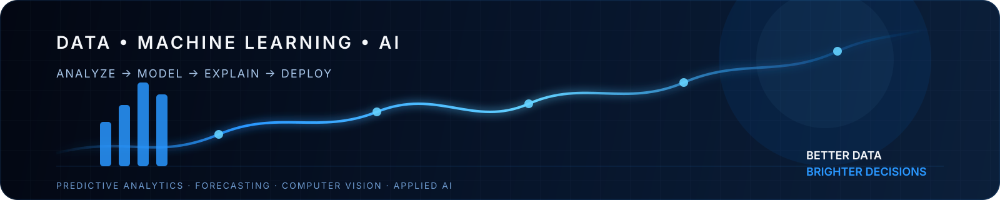

<strong>Turning data into meaningful impact.</strong>

&nbsp;&nbsp;

&nbsp;
<strong>Mumbai, India</strong>

## 👋 About Me

I'm a **Data Science & Machine Learning engineer**, fresh out of a **B.E. in Information Technology from the University of Mumbai (2026)**, focused on the part of ML that comes after the model works — **evaluation, deployment, and building systems that hold up beyond a notebook**.

I like finding real problems and building practical solutions rather than stopping at a proof of concept. My recent work spans **AI analytics, demand forecasting, computer vision, food intelligence, customer analytics, and explainable AI**.

> **Find the problem → prepare the data → build & evaluate → explain the result → deploy a useful solution.**

I'm actively looking for my **first full-time role in Data Science, Machine Learning, or Applied AI** and am available to start immediately.

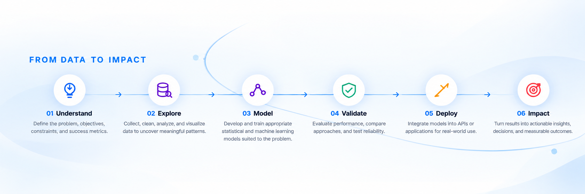

## 🚀 Featured Projects

Real-world projects built with purpose.

### 01 · DataLens AI

<a href="https://github.com/Kaustubh-Suryawanshi19/DataLens">
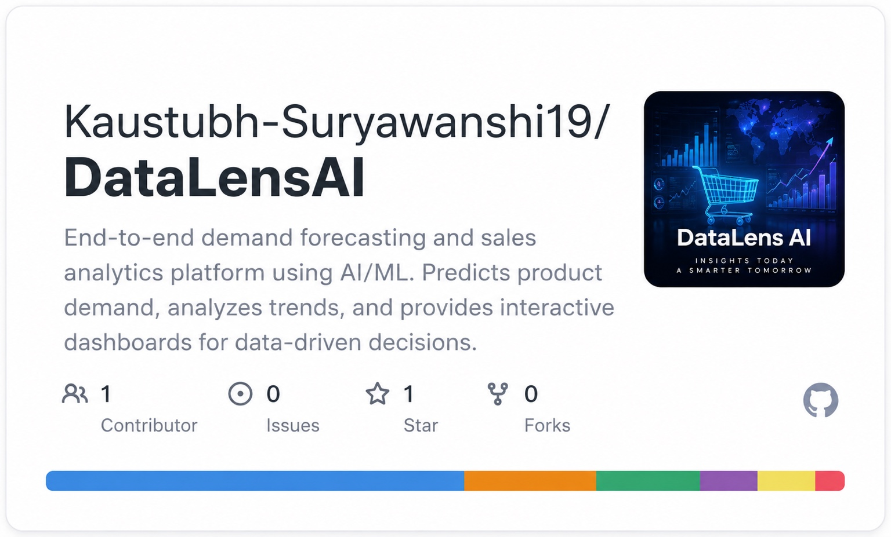
</a>

<strong>AI analytics platform for natural-language data exploration and analysis.</strong> 
Lets users query and analyze datasets using natural language while supporting data-driven insights.

 

<code>Python</code>
<code>Pandas</code>
<code>Scikit-learn</code>
<code>XGBoost</code>
<code>LightGBM</code>
<code>FastAPI</code>
<code>AWS</code>
<code>Docker</code>

 

<a href="https://github.com/Kaustubh-Suryawanshi19/DataLens">View Repository →</a>

---
### 02 · MudraTranslate

<a href="https://github.com/Kaustubh-Suryawanshi19/Indian-Sign-Language-To-Regional-Language-Transalation-System">
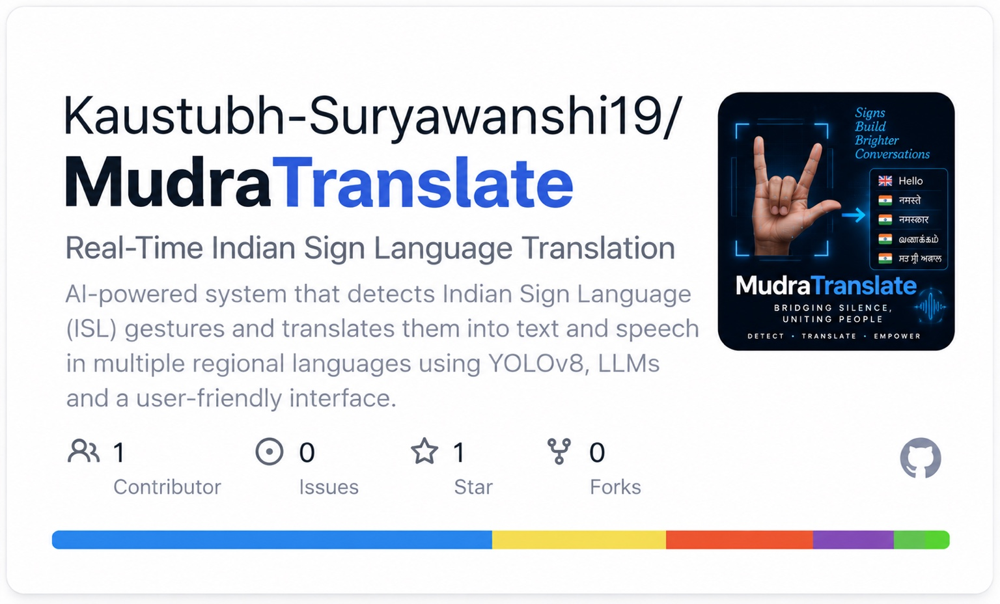
</a>

<strong>Real-time Indian Sign Language detection and translation to text and speech.</strong> 
Uses custom-trained YOLOv8 models and language-model capabilities.

 

<code>Python</code>
<code>YOLOv8</code>
<code>OpenCV</code>
<code>Pytorch</code>
<code>FastAPI</code>
<code>LLM</code>
<code>Computer Vision</code>
<code>Gemini API</code>

 

<a href="https://github.com/Kaustubh-Suryawanshi19/Indian-Sign-Language-To-Regional-Language-Transalation-System">View Repository →</a>

---
### 03 · ScanToKnow

<a href="https://github.com/Kaustubh-Suryawanshi19/ScanToKnow">
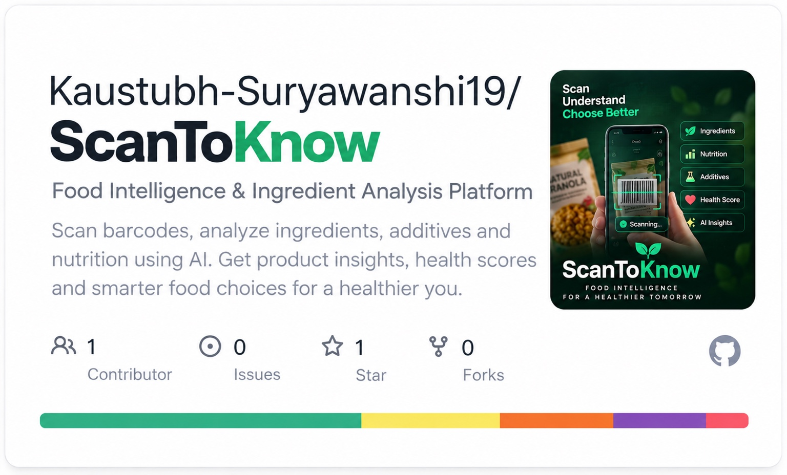
</a>

<strong>Food intelligence & automated ingredient analysis platform.</strong> 
Scans packaged-food products and turns ingredient information into useful consumer insights. Patent filed.

 

<code>Flutter</code>
<code>Django</code>
<code>MongoDB</code>
<code>AI</code>
<code>OCR</code>
<code>Nodejs</code>

 

<a href="https://github.com/Kaustubh-Suryawanshi19/ScanToKnow">View Repository →</a>

---
### 04 · Walmart DemandLens

<a href="https://github.com/Kaustubh-Suryawanshi19/Walmart-DemandLens">
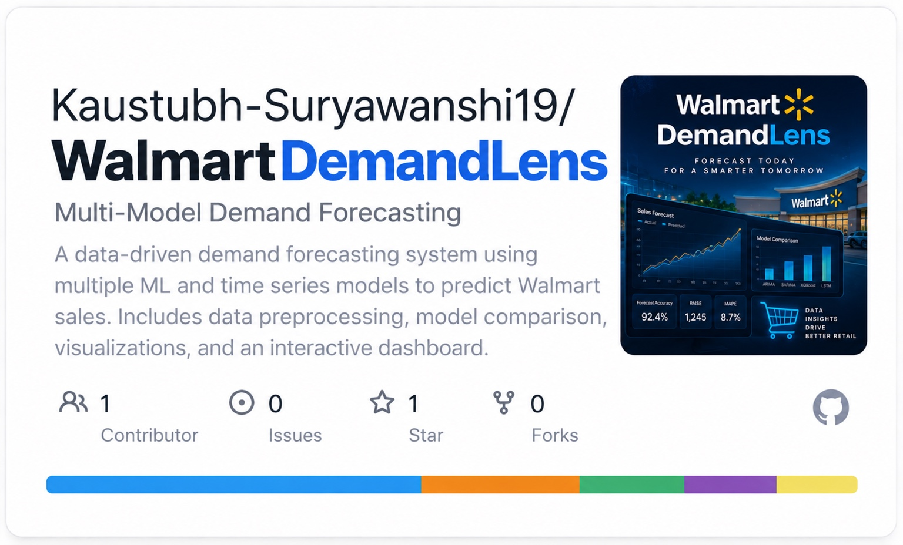
</a>

<strong>Multi-model demand forecasting system for Walmart sales.</strong> 
Combines SARIMA, Prophet, and LightGBM to model and compare forecasting approaches.

 

<code>Python</code>
<code>Pandas</code>
<code>SARIMA</code>
<code>Prophet</code>
<code>LightGBM</code>
<code>Streamlit</code>
<code>FastAPI</code>

 

<a href="https://github.com/Kaustubh-Suryawanshi19/Walmart-DemandLens">View Repository →</a>

---
### 05 · ChurnLens

<a href="https://github.com/Kaustubh-Suryawanshi19/ChurnLens">
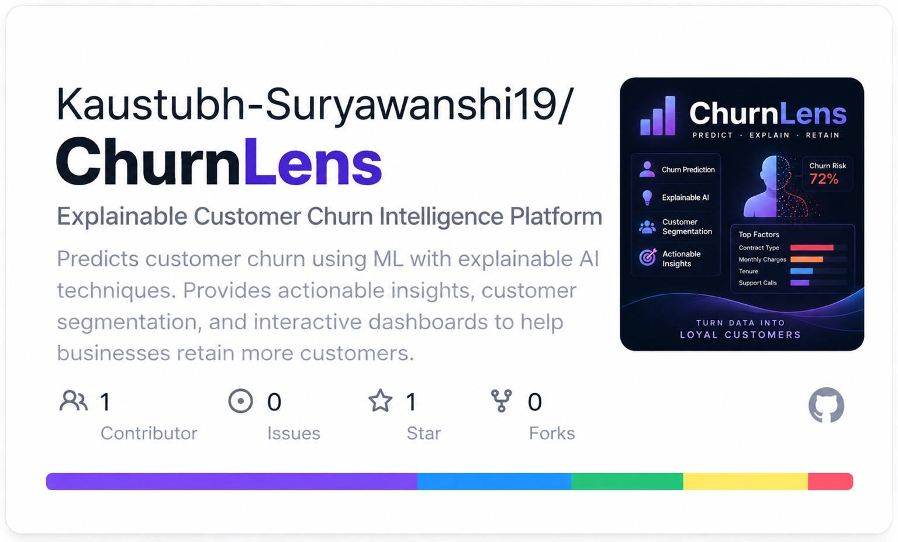
</a>

<strong>Explainable customer churn intelligence platform.</strong> 
Predicts churn, identifies key factors, and supports actionable retention insights.

 

<code>Python</code>
<code>Scikit-learn</code>
<code>XGBoost</code>
<code>SHAP</code>
<code>Explainable AI</code>

 

<a href="https://github.com/Kaustubh-Suryawanshi19/ChurnLens">View Repository →</a>

---

# 🛠️ Technical Skills

### 💻 Languages

&nbsp;Python
&emsp;&emsp;&emsp;

&nbsp;SQL

### 📊 Data & Analytics

&nbsp;Pandas
&emsp;&emsp;&emsp;
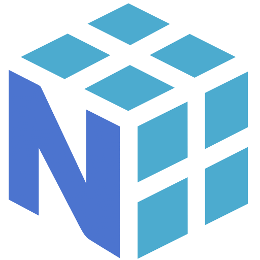
&nbsp;NumPy
&emsp;&emsp;&emsp;
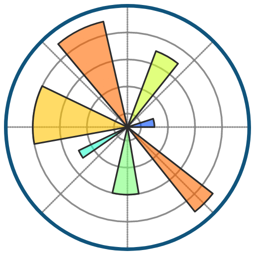
&nbsp;Matplotlib
&emsp;&emsp;&emsp;

&nbsp;Seaborn
&emsp;&emsp;&emsp;
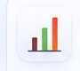
&nbsp;Data Visualization

### 🤖 Machine Learning & AI

&nbsp;Scikit-learn
&nbsp;&nbsp;&nbsp;&nbsp;
&nbsp;XGBoost
&nbsp;&nbsp;&nbsp;&nbsp;
&nbsp;LightGBM
&nbsp;&nbsp;&nbsp;&nbsp;
&nbsp;SARIMA
&nbsp;&nbsp;&nbsp;&nbsp;
&nbsp;Prophet
&nbsp;&nbsp;&nbsp;&nbsp;
&nbsp;TensorFlow
&nbsp;&nbsp;&nbsp;&nbsp;

&nbsp;YOLOv8
&nbsp;&nbsp;&nbsp;&nbsp;
&nbsp;NLP / LLM

### ⚙️ Engineering & Deployment

&nbsp;FastAPI
&emsp;&emsp;&emsp;

&nbsp;Streamlit
&emsp;&emsp;&emsp;
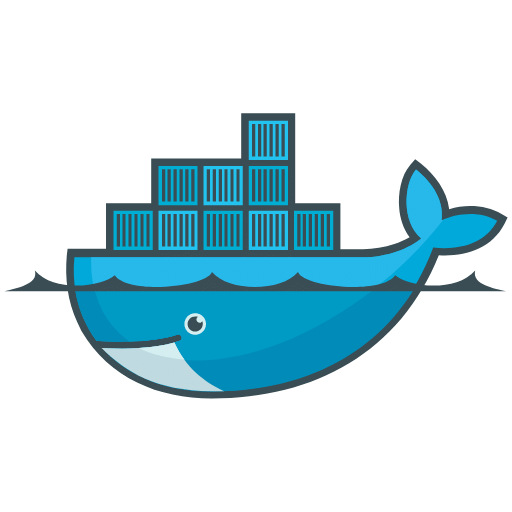
&nbsp;Docker
&emsp;&emsp;&emsp;

&nbsp;AWS
&emsp;&emsp;&emsp;

&nbsp;Git
&emsp;&emsp;&emsp;

&nbsp;Jupyter

### 🗄️ Databases

&nbsp;PostgreSQL
&emsp;&emsp;&emsp;&emsp;

&nbsp;MongoDB
&emsp;&emsp;&emsp;&emsp;

&nbsp;SQLite
&emsp;&emsp;&emsp;&emsp;

&nbsp;Databases

<strong>Additional capabilities:</strong> Feature Engineering · Classification · Regression · Model Evaluation

---

# 🏆 Recognition & Credentials

### 🥇 Honors & Awards

**2nd Place**  
XZIBIT 2026 National Project Competition

**Finalist**  
20th Aavishkar Research Convention

---

### 📜 Certifications

- **IBM Data Science Professional Certificate**
- **AWS Certified Cloud Practitioner**
- **Python for Everybody — University of Michigan**
- Data Visualisation: Empowering Business with Effective Insights
- Software Engineering Virtual Experience Program
- Deloitte Australia — Data Analytics Job Simulation

---

### 📌 Patent

**SCAN-TO-KNOW**  
*Automated Ingredient Analyzer for Packaged Foods*

Patent application filed for an **AI-based food-label / ingredient analysis system**.

<a href="https://github.com/Kaustubh-Suryawanshi19/ScanToKnow">View Project →</a>

# 📚 Currently Learning

- Advanced Machine Learning
- MLOps & Model Deployment
- LLM Applications
- Production ML Systems
- Data Engineering
- Model evaluation, interpretability, and ML system design

## 📈 GitHub Activity & Statistics

  

&nbsp;

## 🎓 Education

**University of Mumbai**  
**Bachelor's Degree — Information Technology · 2026**

Focused on data science, machine learning, databases, and intelligent systems.

---

## 🤝 Let's Build Something Impactful Together

I'm actively looking for my **first full-time opportunity** in **Data Science, Machine Learning, Applied AI, analytics, or intelligent applications** and am available to start immediately.

&nbsp;&nbsp;&nbsp;

&nbsp;&nbsp;&nbsp;

&nbsp;&nbsp;&nbsp;

&nbsp;&nbsp;&nbsp;

  

<strong>Better data. Brighter decisions. 🚀</strong>

